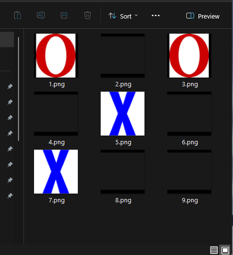

# File Explorer Tic Tac Toe
Playing Tic Tac Toe using the file explorer as the game board.



## How It Works
The game creates 9 blank image files representing the Tic Tac Toe grid. Players take turns making their moves and the game board updates accordingly. The game ends when there's a winner or all the spots on the board have been played.

## Requirements
1. Python 3

## Installation
1. Clone this repo:
```
git clone https://github.com/RD2P/file-explorer-tictactoe.git
```
2. Run `main.py`

## Usage
1. Running `main.py` creates a new directory `./canvas/`
2. Open `./canvas/` in file explorer
3. Resize the file explorer window such that the blank images create a 3x3 grid
4. Follow the prompts in the terminal and enter your moves
5. Watch the board in file explorer udpate with each play

## Author
Raphael
